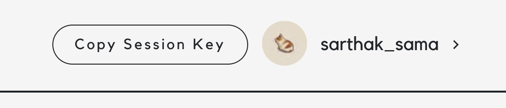
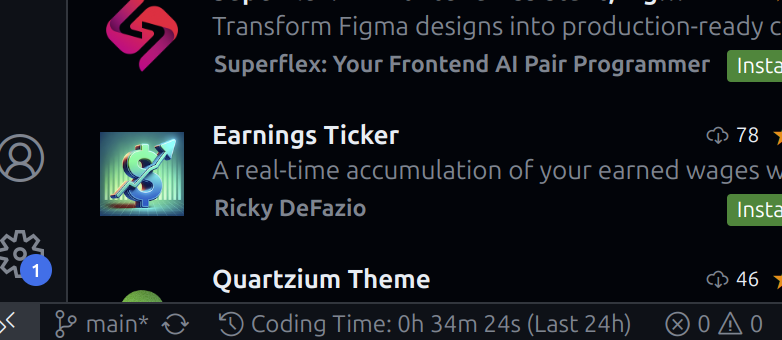

# Code Watch

  
_Tracks your coding time while you work._

## Usage

Once installed, **Code Watch** is ready to use:

- **Set Session Key:**  
  Open the Command Palette (`Ctrl+Shift+P` or `Cmd+Shift+P`) and type `Set Session Key` to configure your session key.

  ##### Where to get Session key ?

  1. Go to [CodeHours](http://localhost:5173/).
  2. Login using your Twitter or Google Account.
  3. Copy **Session Key** from the navbar.

  

- **Toggle Stopwatch:**  
  Use the Command Palette again to execute the `Toggle Coding Timer` command to start or stop the stopwatch.

  

## Table of Contents

- [Introduction](#introduction)
- [Features](#features)
- [Installation](#installation)
- [Commands](#commands)
- [Configuration](#configuration)
- [Screenshots](#screenshots)
- [Contributing](#contributing)
- [License](#license)
- [Contact](#contact)

## Introduction

**Code Watch** is a lightweight Visual Studio Code extension that helps you track your coding time while you're coding. It provides easy-to-use commands to set a session key and toggle a stopwatch timer directly from VS Code, allowing you to monitor your productivity without leaving your editor.

## Features

- **Time Tracking:** Monitor your coding sessions and idle time effortlessly.
- **Customizable Commands:** Easily set your session key and toggle the coding timer.
- **User-Friendly Interface:** Seamless integration with VS Code, keeping the interface minimal and distraction-free.
- **Configuration Options:** Customize your extension settings through the VS Code settings panel.

## Commands

The extension contributes the following commands:

- **`codehours.setToken`**  
  _Title:_ Set Session Key  
  _Description:_ Allows you to set your session key for Code Watch.

- **`codehours.toggleStopwatch`**  
  _Title:_ Toggle Coding Timer  
  _Description:_ Starts or stops the coding stopwatch.

## Installation

1. **Via Visual Studio Marketplace:**

   Open the Extensions view (`Ctrl+Shift+X` or `Cmd+Shift+X`) in VS Code, search for **"Code Watch"**, and click **Install**.

2. **Manually:**

   - Clone or download the repository.
   - Run the following command in the extension folder to package it:
     ```sh
     vsce package
     ```
   - Install the generated `.vsix` file by running:
     ```sh
     code --install-extension codehours-0.0.1.vsix
     ```

## Configuration

You wouldn't generally need to follow this, you can configure the extension using the commands.

Customize your Code Watch settings by navigating to **File > Preferences > Settings** (or using `Ctrl+,`/`Cmd+,`) and searching for **"Code Watch Settings"**. The configuration options include:

- **`codehours.sessionKey`**  
  _Type:_ `string`  
  _Default:_ `""`  
  _Description:_ The session key for the Code Watch extension.

## Contributing

Contributions are welcome! If you would like to contribute to Code Watch, please follow these steps:

1. Fork the repository.
2. Create a new branch (`git checkout -b feature/your-feature-name`).
3. Commit your changes (`git commit -am 'Add new feature'`).
4. Push to the branch (`git push origin feature/your-feature-name`).
5. Open a Pull Request.

Please ensure your code follows the project's style guidelines and includes appropriate tests.

## License

This project is licensed under the [MIT License](LICENSE).

## Contact

For questions, suggestions, or support, please reach out to:

- **GitHub:** [Sarthak-Sama](https://github.com/Sarthak-Sama)
- **Twitter:** [Sarthak_Sama](https://x.com/Sarthak_Sama)
- **LinkedIn:** [Sarthak Saklani](https://x.com/Sarthak_Sama)

Get Tracked, Stay Cracked ! 🚀
